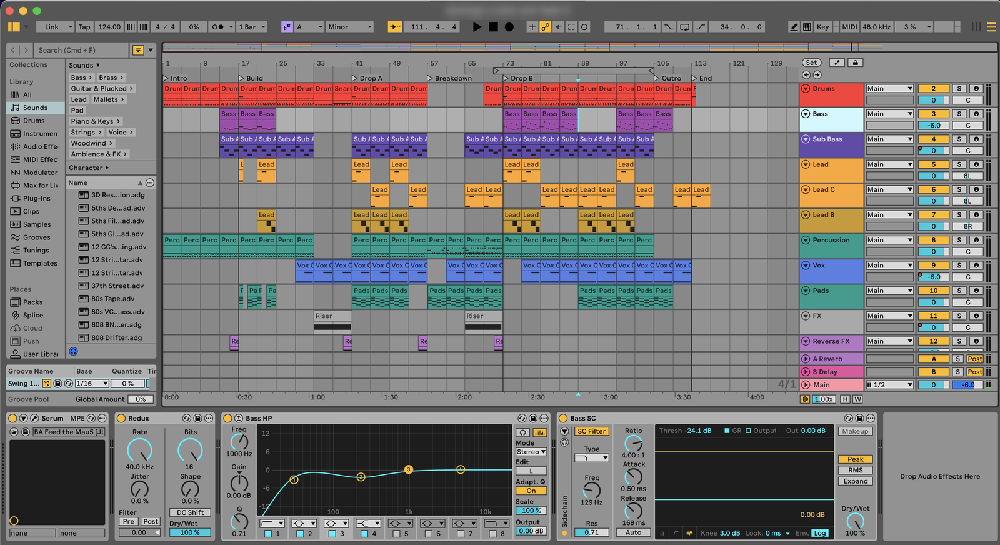
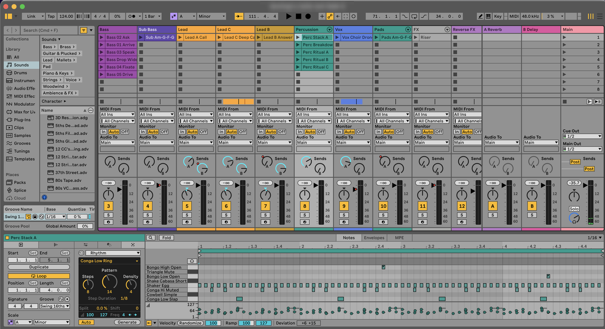
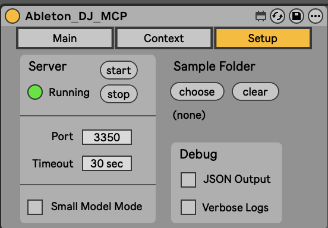

# Ableton DJ MCP

```
    █████╗ ██████╗      ██╗    ███╗   ███╗ ██████╗██████╗
   ██╔══██╗██╔══██╗     ██║    ████╗ ████║██╔════╝██╔══██╗
   ███████║██║  ██║     ██║    ██╔████╔██║██║     ██████╔╝
   ██╔══██║██║  ██║██   ██║    ██║╚██╔╝██║██║     ██╔═══╝
   ██║  ██║██████╔╝╚█████╔╝    ██║ ╚═╝ ██║╚██████╗██║
   ╚═╝  ╚═╝╚═════╝  ╚════╝     ╚═╝     ╚═╝ ╚═════╝╚═╝
   ▁▂▃▄▅▆▇█▇▆▅▄▃▂▁▁▂▃▄▅▆▇█▇▆▅▄▃▂▁▁▂▃▄▅▆▇█▇▆▅▄▃▂▁▁▂▃▄▅▆▇█
```

[](https://github.com/gpulga/ableton-dj-mcp/actions/workflows/ci.yml)
[](./LICENSE)

**Let Claude (or any MCP-capable AI) control Ableton Live.**

Ask in plain language, and the AI reads and edits your open Live set in real
time: tracks, clips, MIDI notes, devices, scenes, automation, playback.



_Song sections, tracks, clips and device chains: everything here is readable and
editable by the AI._

> "Set tempo to 124, add a Drift bass on a new track, and write a rolling
> 16th-note bassline in A minor for 8 bars."
>
> "Read my drum track and add ghost-note hi-hats with some velocity variation."
>
> "Duplicate scene 3, mute the kick for the first 4 bars, and automate the
> filter opening across the break."

It works on the whole set, from arrangement sections down to individual notes
and velocities in a clip:



It ships with electronic-music knowledge (house, tech house, melodic techno,
indie dance and more), so genre and arrangement suggestions start from how those
styles are actually built.

## Capabilities

24 MCP tools (`adj-*`), served over stdio via the portal or directly over HTTP
at `:3350/mcp`. Positions use bar|beat notation. Full schemas are in the
[Tools Reference](./docs/Tools-Reference.md).

| Domain    | Tool                    | Op  | Surface                                                                                    |
| --------- | ----------------------- | --- | ------------------------------------------------------------------------------------------ |
| Session   | `adj-connect`           | R   | Handshake; returns Live version, set overview and usage skills. Required first call        |
|           | `adj-context`           | R/W | Persistent project memory (read/write/append); sample-folder search                        |
| Live Set  | `adj-read-live-set`     | R   | Tempo, time signature, groove, Link, punch/overdub, locators, tracks, scenes, meters       |
|           | `adj-update-live-set`   | W   | Tempo, time signature, groove, Link, punch in/out, overdub, name, locators                 |
| Track     | `adj-read-track`        | R   | Session/arrangement clips, device chain, routing, mixer state, output meters               |
|           | `adj-create-track`      | C   | MIDI, audio or return track at index                                                       |
|           | `adj-update-track`      | W   | Name, color, volume, pan, mute/solo/arm, I/O routing, group fold                           |
| Scene     | `adj-read-scene`        | R   | Name, color, tempo, time signature                                                         |
|           | `adj-create-scene`      | C   | Scene at index                                                                             |
|           | `adj-update-scene`      | W/X | Name, color; launch                                                                        |
| Clip      | `adj-read-clip`         | R   | Notes, timing, loop, sample/warp properties, playhead position                             |
|           | `adj-create-clip`       | C   | MIDI (bar\|beat notes) or audio (file path), Session slot or Arrangement position          |
|           | `adj-update-clip`       | W   | Note add/remove, transform expressions (`velocity *= 0.8`), loop, pitch, volume, flags     |
|           | `adj-microsection-mute` | W   | Velocity-0 mute map of pitches across bar ranges                                           |
|           | `adj-automate`          | R/W | Clip automation envelopes: write points, read (0.25-beat grid), clear; 6 curves, 8 recipes |
| Device    | `adj-browse`            | R   | Live browser tree walk with search; returns loadable URIs                                  |
|           | `adj-create-device`     | C   | Native device by name, or any browser item by URI; supports rack chain paths               |
|           | `adj-read-device`       | R   | Parameters (name, value, range), rack chains, drum pads, drum map                          |
|           | `adj-update-device`     | W   | Parameter writes by name or index, range-clamped; nested racks                             |
| Ops       | `adj-duplicate`         | C   | Track, scene, clip or device copy; Session → Arrangement                                   |
|           | `adj-delete`            | D   | Track, scene, clip or device                                                               |
| Transport | `adj-playback`          | X   | Play/stop, loop, fire/stop clips and scenes, record, MIDI capture, undo/redo, save, nudge  |
|           | `adj-select`            | X   | Set UI selection: track, scene, clip                                                       |
| Generate  | `adj-generate`          | —   | Euclidean/Bjorklund and named rhythms → bar\|beat notes. Pure function, no Live I/O        |

**Op:** R read · W write · C create · D delete · X execute.

## Requirements

- **Ableton Live 12.3+** with **Max for Live** (Suite, or Standard + M4L)
- **Node.js 24+** ([nodejs.org](https://nodejs.org))
- **macOS or Windows**
- An MCP client: [Claude Code](https://claude.com/claude-code), Claude Desktop,
  Cursor, etc.

## Install (about 5 minutes)

```bash
git clone https://github.com/gpulga/ableton-dj-mcp.git
cd ableton-dj-mcp
npm run setup
```

No `npm install` or build step is needed. `setup` installs the Live device and
bridge, then prints the exact command to connect your AI client. Do the few
clicks it lists inside Live, then ask your AI: **"connect to ableton"**.

Full walkthrough and troubleshooting: **[docs/Setup.md](./docs/Setup.md)**.

### Let your AI install it

Open Claude Code (or another coding agent) in any folder and paste:

```
Install Ableton DJ MCP for me by following
https://github.com/gpulga/ableton-dj-mcp/blob/main/docs/Setup.md
```

The agent runs the commands. You do the clicks inside Live that it asks for.

## How it works

```
AI client ──stdio──▶ portal (Node) ──HTTP :3350──▶ Max for Live device ──▶ Live API
                                                   Python bridge (UDP) ──▶ Browser / automation
```

A Max for Live device on a track in your set runs the MCP server. A small portal
process connects your AI client to it. An optional Python remote script adds
things Max can't reach, like the browser and clip automation. Details:
[Architecture](./docs/contributing/Architecture.md).



_The device's Setup tab: server running on port 3350, ready for your AI to
connect._

## Docs

| You want to…                      | Read                                                             |
| --------------------------------- | ---------------------------------------------------------------- |
| Install and connect               | [Setup](./docs/Setup.md)                                         |
| See what the AI can do (24 tools) | [Tools Reference](./docs/Tools-Reference.md)                     |
| Write MIDI in the notation        | [Bar\|beat spec](./docs/specs/BarBeat-Spec.md)                   |
| Hack on the code                  | [CLAUDE.md](./CLAUDE.md) → [docs index](./docs/PROJECT_INDEX.md) |
| Report a bug / request a feature  | [Issues](https://github.com/gpulga/ableton-dj-mcp/issues)        |

## License

[GPL-3.0-or-later](./LICENSE).
